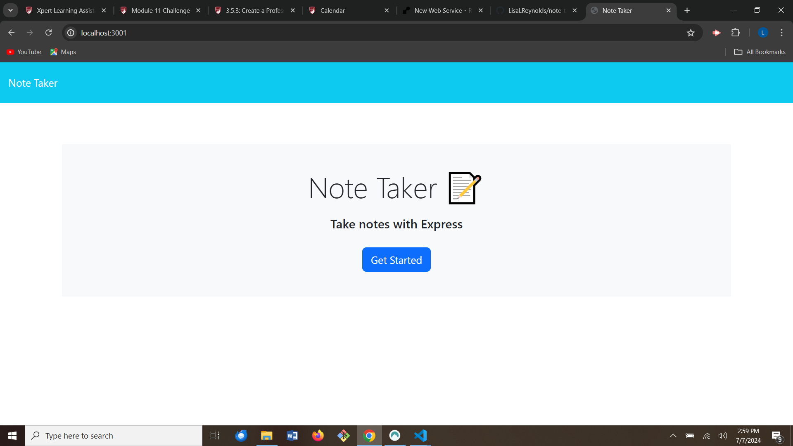
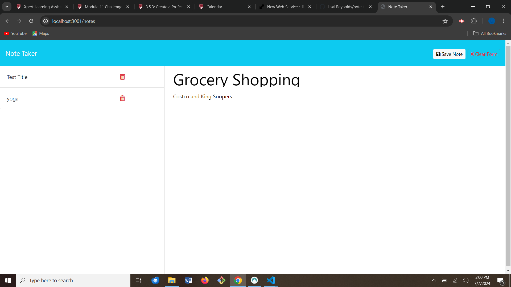
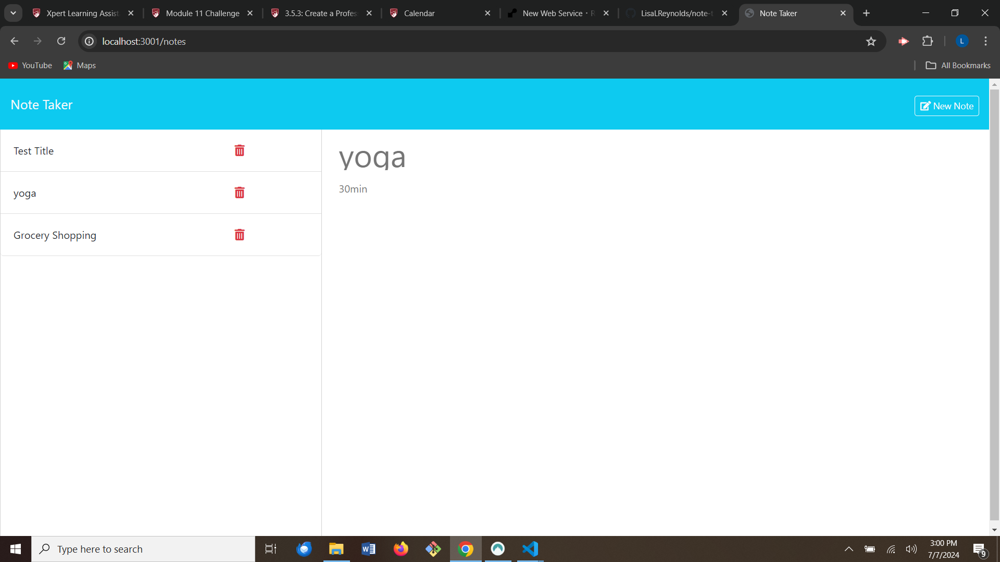

# Note Taker Application

## Description

An application that can be used to write and save notes to the user's to-do list.

## Usage

When first directed to the webpage, the user may click the "Get Started" button.

Then the user will be directed to a new page where they may enter the note title and note text. Once both note title and text have been entered, a "Save Note" button will appear in the upper right corner of the page. A "Clear Form" button can also be found in the upper right corner of the page. If the user clicks the "Save Note" button, the note title will appear in the list on the left side of the screen.

The user may then choose to enter a new note, or choose a note from the list on the left side of the page. If the user clicks on the note title displayed on the left side of the page, it will display the note title and note text to the right of the list.

## Link

Here is a link to the deployed application:
https://note-taker-app-p9db.onrender.com
